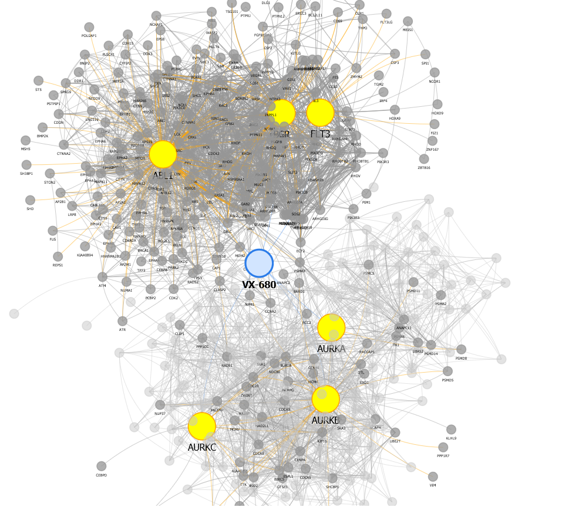
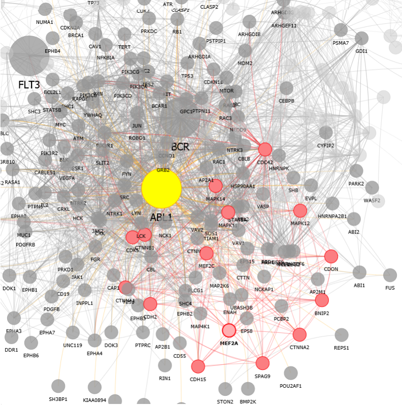

# PPI
PPI is a protein-protein interaction network visualization based on [vis.js](http://visjs.org/). Try it here: http://jeswcollins.github.io/PPI. Please feel free to contribute, question, or criticize.

Based on discussions with colleagues Phil Snyder (Vertex) and Venky Soundararajan (nference), we came up the idea of putting together a protein-protein interaction network visualization to assist in drug development. 

The idea, which Venky suggested, was to see if we could find any second-order effects of a small molecular therapeutic. Such molecules might target one protein in particular, and inhibiting or activating one protein might be a way to cure a disease. But which other proteins does the small molecule interact with? Moreover, which proteins interact with the protein target, and does that interaction depend on the presence of the small moleclue therapeutic? Which proteins do any unintended targets of the small molecule interact with? **Can we predict effects from such 2nd degree interactions in a precise, even personalized way to improve clinical trials, reduce potential for toxicity, or design improved therapeutics?**

I performed such a network analysis, based on data at http://string-db.org/, to find hypothetical means by which VX-680, a small molecule anti-cancer therapeutic, might cause unintended effects on the heart: CXCR4 (via FLT3), MEF2A & MEF2C (via ABL1), DLG1 (via BCR).

##Example Images:
VX680 interactions: 
 
MEF2A interactions: 

##To Do:
- [ ] Improve Graph Display algorithm
- [ ] Choose an external interaction database and provide a form for searching it (perhaps this task could become its own web plugin project)
